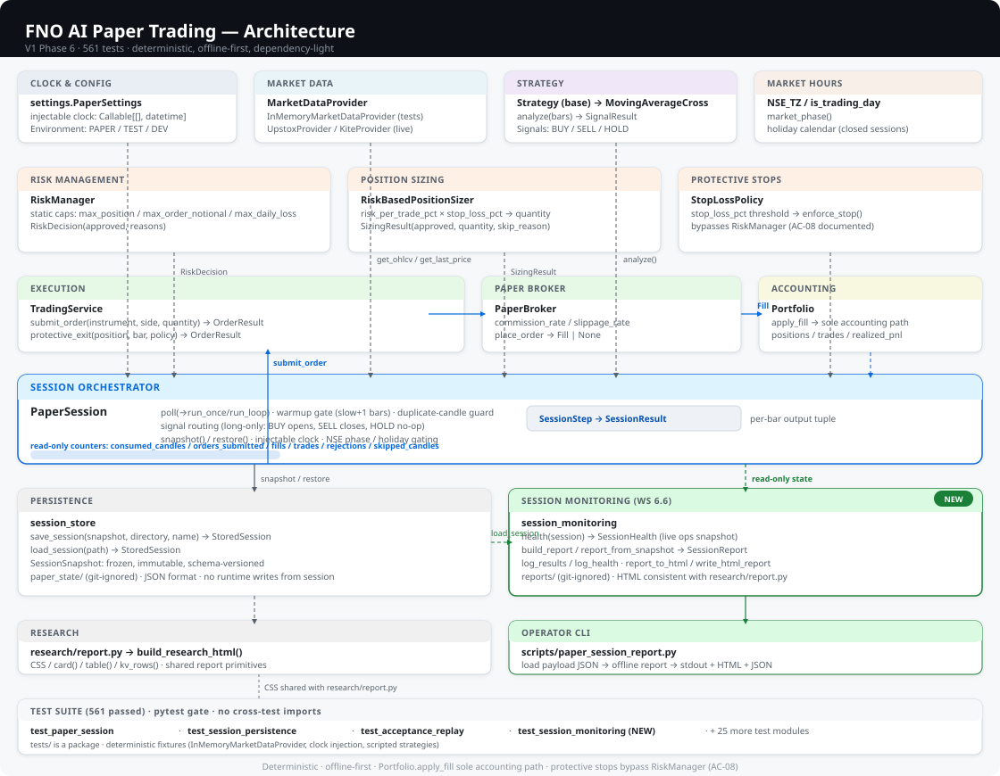

# F&O AI Paper Trading System — Architecture

> Scope: source-of-truth architecture document for `fno-ai-paper-trading`.
> Status: reflects the repository as of the WS 6.6 delivery (2026-09-11).
> This document is generated from and verified against the actual source code — it describes what exists, marks what is configured-but-not-wired, and labels everything else as planned.

---

## 1. Purpose and Scope

`fno-ai-paper-trading` is a modular Python system for **paper-trading Futures & Options (F&O) instruments**. It is a research and simulation system, not a live trading system.

**Purpose.** Provide a disciplined, deterministic foundation for:

1. Normalizing market data from vendor APIs into internal domain models.
2. Generating trading signals from deterministic strategies.
3. Enforcing pre-trade risk limits as a mandatory gatekeeper.
4. Simulating order execution through a paper broker with configurable commissions and slippage.
5. Tracking cash, positions, realized/unrealized P&L, and portfolio value.
6. Backtesting strategies offline against deterministic and real historical datasets.
7. Running scientifically disciplined research (costs, execution assumptions, regime datasets, in/out-of-sample splits, walk-forward, parameter sensitivity, robust metrics) and producing labelled HTML reports.

**Out of scope (by design).**

- **No live order execution.** No code path places real-money orders or contacts a broker order API. `PaperBroker.is_live` is hard-coded to `False` and raising live construction is rejected (`broker/paper_broker.py`).
- **No AI analysis yet.** AI is planned (Phase 3) and will sit behind an interface; it must never bypass the `RiskManager` and never place orders directly.
- **No dashboard/UI.** Analytics/reporting produce flat HTML files (research reports and paper-session reports via `research/report.py` CSS); a live web dashboard is a future consideration.
- **No database / multi-session ledger.** Paper-session state persists as JSON snapshots under git-ignored `paper_state/` (WS 6.5); a durable database is out of scope.

**Audience.** Engineers extending the codebase, reviewers validating claims, and operators running research. Every section references the concrete module that implements the described behavior.

---

## 2. Architecture Principles

The project states its decision principles in `PROJECT_PLAN.md` §29 and codifies the non-negotiable safety rules in §3. The principles that shape the implementation are:

1. **Separation of concerns.** Market data, strategy, AI, risk, execution, portfolio, and analytics are separate packages. No component contains all trading logic; strategy logic does not live in the broker, and risk logic does not live inside strategies.
2. **Paper-only by construction.** Every environment (`development`, `test`, `paper` from `config/settings.py`) forbids live execution. Real-broker integration is a separate, explicitly controlled future capability, never silently enabled.
3. **Determinism.** Financial math uses `decimal.Decimal` only (`utils/functions.py` helpers enforce validation). Backtest fills carry bar timestamps instead of wall-clock time, so a given strategy + dataset always produces identical results. No randomness anywhere in strategies, research regimes, or the backtest engine.
4. **Vendor isolation.** Provider-specific code (Kite, Upstox) is confined to adapter modules that normalize responses into internal domain models. Nothing else in the system depends on a vendor SDK or nomenclature.
5. **Explicit over implicit.** Costs, slippage, execution assumptions, risk limits, and split proportions are explicit configuration. The research sensitivity utility deliberately enumerates combinations rather than optimizing.
6. **Fail safely.** External errors surface as a typed `MarketDataError` hierarchy (`data/errors.py`); a risk-check failure rejects the order with no execution; invalid market data yields a report-only validation issue (never silent repair).
7. **Minimal dependencies.** The runtime depends only on `python-dotenv`; the test suite adds `pytest`. No large frameworks.

---

## 3. System Context

The system sits in the middle of three external worlds, all of which it treats as optional and offline-safe:

```text
                     +-------------------------------------------+
                     |              fno-ai-paper-trading          |
                     |                                           |
   +-----------+     |  +-----------+  +---------+  +---------+  |     +-------------+
   |  ZERODHA  |     |  |   Kite    |  |  InMem  |  |  Upstox |  |     |  RESEARCH   |
   |  Kite API |     |  | provider  |  | provider|  | provider|  |-----|  datasets   |
   |  (market  |-----|  | (read-    |  | (demo,  |  | (read-  |  |     |  (CSV +     |
   |  data,    |     |  |  only)    |  |  tests) |  |  only)  |  |     |   hash)     |
   |  optional)|     |  +-----------+  +---+-----+  +----+----+  |     +------+------+
   +-----------+     |                        |           |      |            |
                     |                        v           v      |            v
                     |                  +----------------+       |    +-------------+
                     |                  | TradingService |       |    |  Backtest   |
                     |                  | StrategyService|       |    |  Engine     |
                     |                  +-------+--------+       |    +-------------+
                     |                          |                |
                     |                    +-----v-----+          |    +-------------+
                     |                    | RiskManager|         |    | Research    |
                     |                    +-----+-----+          |    | modules     |
                     |                          |                |    +-------------+
                     |                    +-----v-----+          |          |
                     |                    | PaperBroker|         |          |
                     |                    +-----+-----+          |          |
                     |                          |                |          |
                     |                    +-----v-----+          |    +-----v-----+
                     |                    | Portfolio  |         |    | HTML report|
                     |                    +-----------+          |    +-----------+
                     +-------------------------------------------+

   Enabled only when the user supplies their own credentials (Kite / Upstox).
   With no credentials, the full app, backtests, tests, and research run offline
   on the deterministic in-memory provider.
```

Key context facts:

- The only providers exercised by the demo entry point and the test suite are in-memory (`data/mock_provider.py`). Kite and Upstox are read-only market-data adapters, unit-tested against mocked HTTP, never placed orders, and activate only when explicit credentials are configured.
- Research consumes either deterministic synthetic series (`research/regimes.py`, `backtest/datasets.py`) or locally stored CSV datasets (`data/dataset_store.py`) fetched once, read-only, from Upstox; `datasets/` and `reports/` are git-ignored.
- No external actor triggers order execution; orders originate only from strategy signals evaluated by `StrategyService` (paper orders) or from demo code, and always pass through `RiskManager` before the paper broker.

---

## 4. High-Level Architecture

The system implements a layered pipeline: **data normalization → strategy → risk → execution → portfolio → analytics**, sharing one set of domain models.



```text
  config/settings.py (FNO_*, .env)
        |
        v
  data/  (providers -> normalized MarketPrice/MarketQuote/Instrument)
        |
        v
  strategies/  (Strategy ABC -> StrategyEngine -> SignalResult)
        |
        v
  risk/  (RiskManager.evaluate -> RiskDecision) + sizer/ + stop_loss/
        |
        v
  broker/  (Broker ABC -> PaperBroker -> Fill)
        |
        v
  portfolio/  (Portfolio: cash, positions, P&L)
        |
        v
  backtest/ + research/  (offline evaluation, metrics, HTML reports)
```

Cross-cutting packages:

- `models/` — the shared domain vocabulary (`Instrument`, `MarketPrice`, `MarketQuote`, `MarketSession`, `Order`, `Fill`, `Position`, `Trade`, enums).
- `utils/` — dependency-free helpers: `functions.py` (Decimal validators, notional, id generation), `http.py` (Windows `curl.exe` transport with `urllib` fallback), `retry.py` (exponential backoff), `logging.py` (structured logging that never emits secrets).
- `services/` — orchestration: `TradingService` (data → risk → broker → portfolio), `StrategyService` (signals → risk → paper broker), `PaperSession` (deterministic session loop with injectable seams), and `session_monitoring` (live health, offline/online reports, operator logging — WS 6.6).
- `persistence/` — `session_store.py`: snapshot persistence for `PaperSession` state under `paper_state/` (git-ignored).

**Same-risk-path guarantee.** Live-paper path, strategy path, and backtest path all route orders through the same `RiskManager` first; a rejected order produces no execution in every path (confirmed by `tests/test_strategy_service.py` and `tests/test_backtest.py`).

---

## 5. Repository / Package Structure

```text
fno-ai-paper-trading/
|-- .env.example              # Safe template; real values go in git-ignored .env
|-- .gitignore                # Excludes .env, .venv, reports/, datasets/, paper_state/
|-- PROJECT_PLAN.md           # Master plan, safety rules, change log
|-- README.md                 # Build/run/test instructions + safety guarantees
|-- requirements.txt          # python-dotenv, pytest
|-- docs/
|   |-- trading/PAPER_TRADING_V1.md   # V1 paper-session specification (contract)
|   `-- architecture/ARCHITECTURE.md  # this document
|       `-- architecture.svg          # layered architecture diagram (hand-authored SVG)
|-- src/
|   |-- main.py                          # Entry point (Phase 1 + strategy + backtest demos)
|   `-- fno_ai_paper_trading/
|       |-- config/settings.py           # Env-based PaperSettings/KiteSettings/UpstoxSettings
|       |-- models/                      # enums, instruments, order, position, market
|       |-- data/                        # provider ABC + mock/kite/upstox + market_hours +
|       |   |                            #   intervals, instrument_registry, errors,
|       |   |                            #   dataset_store, validation
|       |-- strategies/                  # base, engine, moving_average_cross
|       |-- risk/                        # manager.py, sizer.py, stop_loss.py
|       |-- broker/                      # base.py, paper_broker.py
|       |-- portfolio/                   # portfolio.py
|       |-- services/                    # trading_service.py, strategy_service.py,
|       |   |                            #   paper_session.py, session_monitoring.py
|       |-- persistence/                 # session_store.py (snapshot save/load)
|       |-- backtest/                    # config, engine, result, datasets, __main__
|       |-- research/                    # costs, execution, regimes, split, walkforward,
|       |   |                           #   sensitivity, benchmark, metrics, experiment,
|       |   |                           #   report, real_data, __main__
|       `-- utils/                       # functions, http, retry, logging
|-- scripts/                 # acquire_dataset.py, research_real_data.py,
|                            #   upstox_smoke_test.py, generate_research_report.py,
|                            #   generate_test_report.py, paper_session_report.py
`-- tests/                  # 561 unit tests, no network, no external deps
```

Build/run facts: Python 3.13+; virtualenv `.venv`; `pip install -r requirements.txt`; `python src/main.py` for demos; `pytest` for the suite; both `python -m fno_ai_paper_trading.backtest` and `python -m fno_ai_paper_trading.research` run offline demos.

---

## 6. Data Acquisition Layer

**Interface.** `data/provider.py` defines the `MarketDataProvider` abstract base:

- `get_instruments`, `get_instrument` — instrument master lookups.
- `get_market_price`, `get_last_price`, `get_quote`, `get_market_session` — live-ish snapshots.
- `get_ohlcv`, `get_historical_ohlcv` — bar series.

**Implementations.**

| Provider | Module | Role | Network |
|---|---|---|---|
| `InMemoryMarketDataProvider` | `data/mock_provider.py` | Deterministic sample instruments (a future + a CE + a PE, NIFTY1, lot size 75) and deterministic OHLCV/crossing series; used by the demo and the test suite. `_session_template()` always reports an OPEN session. | never |
| `KiteHistoricalDataProvider` | `data/kite_provider.py` | Zerodha Kite Connect v3 read-only adapter: quote, LTP, instrument-master CSV, historical candles, market status. Auth header `Authorization: token <api_key>:<access_token>`, `X-Kite-Version: 3`. Interval buckets `{minute, 3minute, 5minute, 10minute, 15minute, 30minute, 60minute, day}`. | only when `FNO_KITE_API_KEY` + `FNO_KITE_ACCESS_TOKEN` set |
| `UpstoxHistoricalDataProvider` | `data/upstox_provider.py` | Upstox V3 historical-candle client. **Read-only by construction** — `GET /v3/historical-candle` only; no order endpoint, no write surface. `Authorization: Bearer <token>`; instrument key `{SEGMENT}|{symbol}`; candle row `[iso_timestamp, open, high, low, close, volume, open_interest]`. Normalizes minutes/hours, days, weeks, months into `MarketPrice`. | only when `UPSTOX_ACCESS_TOKEN` set |

**Read-only guarantee.** Both real adapters are historical/quoting clients only. The only HTTP method used by the acquisition scripts is `GET` against the historical-candle endpoint (`scripts/acquire_dataset.py` docstring). There is no order-routing surface in the data layer, making live executions impossible from it.

**HTTP transport.** `utils/http.py` is the single transport used by providers. On Windows it shells out to `curl.exe` (`schannel` TLS) because stdlib `urllib`'s TLS fingerprint is blocked by Cloudflare WAF in front of `api.upstox.com` (HTTP 403 / error 1010 browser-signature-banned); non-Windows environments fall back to `urllib`. Public helpers `http_request`/`http_get` return `HttpResponse` or raise `HttpError`; `is_retryable_status` classifies transient statuses.

**Instrument registry.** `data/instrument_registry.py` is a curated index-only registry: NIFTY 50 → `NSE_INDEX|Nifty 50` (lot size 1, tick size 0.05), BANKNIFTY, FINNIFTY. It provides `get_research_instrument(name)` and `instrument_from_upstox_key(key)`. Master-file download is intentionally not automated.

**Interval mapping.** `data/intervals.py` provides one canonical token set (`1m` … `1M`) mapped to each vendor's bucket names, so research code never knows a provider's nomenclature. `canonical_interval` is case-sensitive for the `1m`/`1M` month pair.

**Market hours.** `data/market_hours.py` fixes `NSE_TZ = UTC+05:30`; pre-open 09:00, open 09:15, close 15:30; `HOLIDAYS_2026` (26 Jan, 3 Apr, 25 Dec); helpers `is_trading_day`, `market_phase` (PRE_OPEN/OPEN/CLOSED), `is_market_open`, `market_session`.

**Errors.** `data/errors.py` defines `MarketDataError` and typed subclasses: `ProviderConfigurationError`, `AuthenticationError`, `RateLimitError`, `InstrumentNotFoundError`, `MarketClosedError`, `UnavailableError`.

**Timeouts/retries.** Providers use `utils/retry.py` (`retry_call`, exponential backoff, injectable `sleep` for deterministic tests) and honor per-vendor `_TIMEOUT_SECONDS`/`_MAX_RETRIES`.

**Real-data acquisition flow.** `scripts/acquire_dataset.py` (fetch → validate → store) and `scripts/upstox_smoke_test.py` (opt-in connectivity check) both exit code 2 unless `UPSTOX_ACCESS_TOKEN` is set. `scripts/research_real_data.py` runs the full NIFTY 50 baseline study; `--smoke` validates the pipeline offline with synthetic data.

---

## 7. Data Validation Layer

**Module.** `data/validation.py`.

- `validate_bars(bars)` returns a `ValidationReport` (list of `ValidationIssue` objects, each typed `error` or `warning` with an `index`).
- Checks include ordering, duplicates, OHLC sanity (high ≥ open/close, low ≤ open/close), timezone hygiene, and cadence gaps.
- **Report-only by design.** Validation never repairs or drops data; it reports so the caller can decide. `scripts/acquire_dataset.py` exits code 2 when validation does not pass (`--no-save` keeps the fetch read-only); the research experiment pipeline re-validates every `StoredDataset` and raises `ValueError` on bad data before backtesting.

**Model-level validation.**

- `models/market.py` `MarketPrice.__post_init__` enforces non-negative OHLCV and high ≥ open/close, low ≤ open/close.
- `models/position.py` `Position` rejects zero quantity, non-negative entry price; `Trade` validates non-empty `trade_id`, finite signed `realized_pnl`, positive quantity, positive price, non-negative commission.
- `models/order.py` validates order fields; `enum` members constrain side/type/status; `Order.transition()` enforces a deterministic lifecycle state machine.
- `portfolio/account.py` `PaperAccount` represents V1 virtual-account identity and policy; `portfolio/portfolio.py` `Portfolio.long_only` rejects `SELL`-to-open/oversell fills at `apply_fill`.
- `utils/functions.py` `non_negative_decimal`, `positive_decimal`, `positive_int`, `non_negative_int`, `to_decimal` (Decimal-str conversion, never silent binary float) back all money/int validation.

**Storage format.** `data/dataset_store.py` persists a dataset as `<name>.csv` plus `.meta.json` containing a deterministic `data_hash` — SHA-256 over the canonical CSV text — and `SCHEMA_VERSION = "1"`. Timestamps are naive IST. `datasets/` is git-ignored.

---

## 8. Research and Backtesting Layer

### Backtesting (`backtest/`)

- `config.py` — `BacktestConfig`: `initial_capital` (default **100000**), `quantity` (default 1), `commission_rate` (0.0003), `commission_fixed` (0), `slippage_rate` (0.001), `enable_risk_manager` (True), risk limits `max_position_quantity` (75), `max_order_notional` (250000), `max_daily_loss` (10000). Optional duck-typed `cost_schedule` (exposes `compute(side, notional, quantity) -> .total`) and `execution` (exposes `total_adverse_rate`) override the legacy commission/slippage fields when set; both default to `None` (backward compatible, regression-tested).
- `engine.py` — `BacktestEngine.run(bars, strategy, config)`. No look-ahead: at bar `i` the strategy sees only `bars[:i+1]`, orders fill at that bar's close. Fills are produced by `BacktestBroker` (a `PaperBroker` subclass) stamped with **bar timestamps** for full determinism. Risk gating identical to live paper trading. Round-trip trade statistics count closed positions only; a position left open at end-of-data is reported with unrealized P&L, with no phantom closing trade.
- `result.py` — `BacktestResult` (final_equity, total_pnl, total_return_pct, max_drawdown + pct, num_trades, win_rate, gross_profit/loss, profit_factor, total_commission, slippage_cost) and `EquityPoint` per-bar equity snapshots.
- `datasets.py` — deterministic, hand-verified OHLCV fixtures (`build_profitable_series`, `build_losing_series`, `build_drawdown_series`, `build_multiple_trades_series`, `build_no_trade_series`, `build_short_profit_series`) plus the `closes_to_bars` alias used by research regimes.
- `__main__.py` — offline demo (`python -m fno_ai_paper_trading.backtest`): MA(2,3) over the profitable fixture with capital 100000 / qty 10 — mechanics evidence, not a profitability claim.

### Research (`research/`)

- `costs.py` — configurable Indian cost model (`IndiaCostSchedule`, `nse_fo_illustrative()`): brokerage, STT (sell side), exchange/transaction charges, SEBI, stamp duty (buy side), GST on brokerage+exchange+SEBI, and other charges; exact `Decimal`, no per-fill rounding; `ChargeBreakdown.total`. Documented as **illustrative example values, not any broker's current fees**.
- `execution.py` — `ExecutionAssumptions`: `slippage_rate` (0.0005) + `half_spread_rate` + `impact_rate` → single `total_adverse_rate` applied per fill exactly like the engine's slippage.
- `regimes.py` — six deterministic, hand-verifiable synthetic price paths (sustained uptrend/downtrend, sideways/choppy, volatile, trend reversal, low-volatility) built from explicit formulas/lists — no randomness, no floating point.
- `split.py` — chronological, contiguous, non-overlapping train/validation/test split (default 60/20/20, must sum to 1), floor-adjusted so segments exactly cover the series.
- `walkforward.py` — rolling `[train][test] → advance` windows; each test window strictly out-of-sample; `build_strategy(train_bars)` factory is the explicit "fit on train" seam.
- `sensitivity.py` — runs only explicitly enumerated `(fast, slow)` combinations; invalid pairs (fast ≥ slow) are reported as skipped, never executed. Deliberately **not** an optimizer.
- `benchmark.py` — gross buy-and-hold on the same bars (100% exposure, no costs) for like-for-like comparison; labelled as gross price returns.
- `metrics.py` — deterministic net-of-cost metrics (P&L, return, CAGR, max drawdown + duration, win rate, profit factor, expectancy, annualized vol / Sharpe / Sortino, exposure) with **`None` = "unavailable"** semantics where a number is meaningless (no return variance → Sharpe None, too-short period → CAGR None, no trades → expectancy None). Daily annualization default (252 bars/year).
- `experiment.py` — self-describing `ExperimentConfig` (strategy, params, dataset, dates, capital, cost/execution assumptions) with a deterministic SHA-256 `config_hash`; `run_experiment()` runs the backtest, computes metrics, optionally attaches the benchmark, and folds `backtest_settings` canonical JSON into the hash.
- `report.py` — composable, labelled HTML report builders (configuration, dataset, strategy params, gross/net performance, costs, slippage, drawdown, trade stats, benchmark, IS/OOS, sensitivity). Rendered by `scripts/generate_research_report.py` to `reports/research_report.html` (git-ignored).
- `real_data.py` — reproducible real-data study on NIFTY 50 daily bars: dataset validation, descriptive statistics, 60/20/20 IS/OOS split, full-period gross buy-and-hold benchmark, parameter sensitivity on in-sample data only (locked baseline fast=5, slow=21), walk-forward OOS evaluation, regime slices. Orchestrated by `scripts/research_real_data.py`.
- `__main__.py` — offline research demo (`python -m fno_ai_paper_trading.research`) over synthetic regimes with the illustrative cost schedule.

### Anti-overfitting stance

No grid search, no optimizer, no ML. Parameters are fixed explicitly; sensitivity runs only user-enumerated combinations; every claim is reported net of the configured costs with out-of-sample evidence shown alongside. All research output is labelled as historical/synthetic evidence, and the illustrative cost schedule is a documented assumption, not a claim of current fees.

### Known real-data research results (retained for reference)

The 2026-09-07 baseline run on NIFTY 50 daily bars (2,477 bars, 2015-01-01 → 2024-12-31; `datasets/upstox_Nifty_50_1d_20150101_20241231.meta.json`, data_hash beginning `2dde47d4`):

| Segment | Net return | Trades | Max drawdown |
|---|---|---|---|
| Full period | −17.66% | 74 | 20.13% |
| Out-of-sample (locked params) | +7.08% | 11 | 3.29% |
| Buy-and-hold (gross) | +30.72% | — | — |

These are **historical/synthetic research results** into `reports/real_data_research_report.html` (git-ignored); they are not trading results, and the MA(5,21) full-period figure is negative — the framework exists to reveal costs, not to maximize backtest returns.

---

## 9. Strategy Layer

**Interface.** `strategies/base.py` defines the `Strategy` ABC returning `SignalResult` (signal = BUY / SELL / HOLD, plus optional reasoning and a flag for whether it is actionable). Strategies are **stateless and deterministic** by contract.

**Engine.** `strategies/engine.py` `StrategyEngine.evaluate(bars, strategy)` prefix-replays bars — at bar `i` the strategy sees only `bars[:i+1]` — and suppresses actionable signals until the strategy's required warm-up.

**Implementation.** `strategies/moving_average_cross.py` `MovingAverageCrossStrategy(fast=5, slow=21)` emits BUY when the fast SMA crosses above the slow SMA and SELL on the opposite cross; it requires `slow + 1 = 22` bars before the first non-HOLD signal. It is the first and currently only strategy.

**Services.** `services/strategy_service.py` is the only place strategy signals become orders: it evaluates the strategy on a bar window, passes the resulting signal through `RiskManager` (risk-gated), then submits a **paper order through `PaperBroker` only** via `TradingService`. `OrderResult` (or `SignalDecision`) reports the outcome; a `SignalDecision` optionally carries its `SizingResult`. With no sizer injected, orders use the fixed `quantity` (default 1). When a `RiskBasedPositionSizer` is injected, a BUY entry is sized first from explicit decision-time inputs (equity marked to the bar close, available cash, entry price, instrument, current quantity) per the V1 formula — 1% of equity over a 2% stop distance, lot-rounded down, cash-bounded; a rejected sizing submits **no order** and records a `skip_reason` on the `SignalDecision`. SELL orders are never sized (V1 is long-only). Strategies never call the broker directly and never bypass `RiskManager` (project safety rule §3.11–13).

---

## 10. Paper Trading Architecture

**Broker contract.** `broker/base.py` `Broker` ABC declares `place_order(order, market_price=None) -> Fill | None`, `cancel_order(order_id)`, `get_order(order_id)`, and the hard guard `is_live: bool = False`. A real broker adapter would have to satisfy this contract in a later phase.

**PaperBroker.** `broker/paper_broker.py`:

- `PaperBrokerConfig`: `commission_rate` (0.0003), `commission_fixed` (0), `slippage_rate` (0.001).
- `is_live` is hard-coded `False`; live construction raises.
- `place_order` validates, applies slippage (`_apply_slippage`), computes commission (`_compute_commission`), returns a `Fill`, and stamps fills with `datetime.now()` (wall clock) — the one place the backtest engine diverges by using bar timestamps instead.
- Tracks order status transitions and supports cancellation; `get_order` returns the order or `None`.

**Portfolio.** `portfolio/portfolio.py` `Portfolio` holds cash, positions (keyed by instrument), trade history, realized P&L; `apply_fill` debits/credits cash and records `Trade`s; `unrealized_pnl`, `realized_pnl_today`, `total_value` computed over current prices. Positions use signed quantity in `models/position.py` (positive = long). By default `Portfolio` does **not** enforce a negative-cash guard — the `RiskManager` static caps are the intended gate, and the generic portfolio admits overdraw. A V1 paper account enables the `long_only` policy (`Portfolio.long_only=True`) so that `apply_fill` rejects any `SELL` fill that would open or increase a short position.

**Risk gate.** `risk/manager.py` `RiskManager.evaluate(order, portfolio, fill_price, realized_today=None)` returns a `RiskDecision` (approved or rejected with `RejectionReason`s) checking:

- `max_position_quantity` (default 75) — resulting position would exceed the per-instrument limit.
- `max_order_notional` (default 250000) — order notional (`quantity * price * multiplier`) exceeds the cap.
- `max_daily_loss` (default 10000) — realized daily loss already breached; further orders rejected.
- Unknown instrument → rejected.

These current limits are **static caps**, not the V1 session rules. V1 risk-based sizing (1% of current equity per trade over a 2% stop distance) is **implemented** as `RiskBasedPositionSizer` (see §13) and consumed by the V1 paper session (WS 6.4b); the 2% stop-loss execution is **implemented** by `risk/stop_loss.py` and wired into the session (WS 6.4/6.4b) — see §13–§18. The `FNO_PAPER_*` env wiring for the five scaffolded `PaperSettings.paper_*` fields remains out of scope.

**Order flow (paper).**

```text
 Signal (Strategy) ──► StrategyService ──► RiskManager ──► PaperBroker ──► Portfolio
                                     (reject = no execution)     (fill, slippage, commission)
```

**Environment.**
- `Environment` enum (`development` / `test` / `paper`) — all paper-only; nothing about the environment can enable live execution.
- `.env.example` documents `FNO_ENVIRONMENT`, `FNO_PAPER_INITIAL_CAPITAL` (100000), `FNO_PAPER_MAX_POSITION_QUANTITY` (75), `FNO_PAPER_MAX_ORDER_NOTIONAL` (250000), `FNO_PAPER_MAX_DAILY_LOSS` (10000), commission/slippage, log level, plus read-only Kite/Upstox credential stubs (empty). `.env` is git-ignored and never read by this repository's agents.

**Deployment footprints.** A Python 3.13+ runtime with `.venv`; app/backtest/research run offline with zero credentials; real-data scripts require the user's own `UPSTOX_ACCESS_TOKEN`.

---

## 11. Configuration Architecture

**Module.** `config/settings.py` — three frozen dataclasses, all env-driven and credential-free by default:

| Settings | Env prefix | Purpose |
|---|---|---|
| `PaperSettings` | `FNO_` | Paper-run defaults: capital, risk caps, commission/slippage, log level, environment. **Plus five V1 paper-session fields**: `paper_interval` ("5m"), `paper_lookback_days` (3), `paper_risk_per_trade_pct` (0.01), `paper_stop_loss_pct` (0.02), `paper_state_dir` ("paper_state"). Three are consumed as `PaperSession` defaults (WS 6.4b); none are wired into `load_settings()` yet. |
| `KiteSettings` | `FNO_KITE_*` | Read-only Kite client: api_key, access_token (empty by default), base_url, timeout, max_retries; `configured` is True only when both credentials present. |
| `UpstoxSettings` | `UPSTOX_*` | Read-only Upstox client: client_id/secret (SSO flow placeholders), access_token, base_url, timeout, max_retries; `configured` True when a token is present. |

- `load_settings`, `load_kite_settings`, `load_upstox_settings` load `.env` (or an explicit file) then read process env; exported variables take precedence.
- **Secrets:** all real credentials belong in git-ignored `.env` or the environment; `.env.example` contains only template/empty values; no module hard-codes credentials and no module logs them (`utils/logging.py` explicitly never emits environment values).
- **Wiring note.** `PaperSettings` validates the five `paper_*` fields in `__post_init__`; `load_settings()` constructs `PaperSettings` without those fields (they keep their dataclass defaults). `PaperSession` consumes three of the five as defaults (`paper_interval`, `paper_risk_per_trade_pct`, `paper_stop_loss_pct`, WS 6.4b); `FNO_PAPER_*` env wiring for all five is still not implemented.

---

## 12. Market Hours and Trading Calendar

**Module.** `data/market_hours.py`:

- `NSE_TZ = datetime.timezone(utc_offset, name="IST")` — fixed UTC+05:30; no DST.
- Session window: PRE_OPEN 09:00, OPEN 09:15, CLOSE 15:30. Phase during these is `MarketPhase.PRE_OPEN` / `MarketPhase.OPEN`; outside is `MarketPhase.CLOSED`.
- `HOLIDAYS_2026`: 26 January, 3 April, 25 December.
- Helpers: `is_trading_day(day)` (weekday and not a holiday), `market_phase(now)` (PRE_OPEN/OPEN/CLOSED), `is_market_open(now)`, `market_session(now)` returning a `MarketSession` (open/closed, phase, observed_at, open_time, close_time, exchange, label); next-open rollover handled.

**Purpose.** Gating logic for the paper-session loop (WS 6.4b): the session skips
trading outside the NSE OPEN phase and on holidays; it also drives provider
market-status calls (`KiteProvider.get_market_status`, `get_market_session`) and
unit tests (`tests/test_market_hours.py`).

---

## 13. Risk and Position Sizing Boundaries

**What exists (implemented).**

- `RiskManager` (see §10) is a mandatory pre-trade gate on every execution path: strategy service, trading service, and backtest engine. Rejection reasons map 1:1 to `RejectionReason` enum members; a rejected order yields `RiskDecision.rejected=True` and no fill.
- Limits are **static, environment-configurable caps**: `max_position_quantity` (75), `max_order_notional` (250000), `max_daily_loss` (10000). Position toggling (quantity sign) is respected; the risk gate is evaluated against the resulting position.
- V1 account-policy guards: `Portfolio.long_only` (rejects `SELL`-to-open/oversell fills at `apply_fill`) and `PaperAccount` (V1 virtual-account identity with `long_only` enabled by default) are implemented at the model/accounting layer.
- V1 risk-based position sizing (`risk/sizer.py` `RiskBasedPositionSizer`): a pure, deterministic, `Decimal`-only sizer over explicit decision-time inputs (`equity`, `available_cash`, `entry_price`, `instrument`, `current_quantity`). It implements the full §6 contract — `risk_amount = equity * 1%`, `stop_distance = entry_price * 2%`, `stop_price = entry_price * (1 − 2%)`, raw quantity rounded **down** to whole instrument lots, single-position (`current_quantity != 0` skips), BUY-only (a SELL never passes through sizing), and a cash/no-leverage bound (`qty * entry * mult * (1 + commission_rate) + commission_fixed <= available_cash`). Every rejection returns an `approved=False` `SizingResult` with a `skip_reason`. `StrategyService` uses it for BUY entries when one is injected, `PaperSession` uses it as the session sizer (WS 6.4b), and `RiskManager` remains the final authoritative gate over the sized order. `SizerConfig` mirrors the paper cost defaults (1% risk, 2% stop, 0.03% commission); `PaperSettings.paper_risk_per_trade_pct` / `paper_stop_loss_pct` feed the session defaults.

**Paper-session runtime (V1, delivered by WS 6.4b/6.5/6.7).**

- `services/paper_session.py` (`PaperSession`): completed-candle cadence, `_consumed`
  duplicate guard, NSE phase/holiday gating, 22-bar warm-up gate, long-only
  BUY/SELL/HOLD routing, daily-loss policy, signal-first/stop-second ordering,
  `run_once`/`run_loop`, injected `clock`/provider, `Environment.PAPER` guard.
- 2% stop-loss execution (`risk/stop_loss.py`, WS 6.4): `StopLossPolicy` +
  `enforce_stop` via `TradingService.protective_exit`; wired into the session with
  the "worse of candle open and stop price" rule.
- Persistence (`persistence/session_store.py`, WS 6.5): JSON snapshots (payload +
  meta sidecar, SHA-256 `state_hash`) under git-ignored `paper_state/`;
  `PaperSession.snapshot()`/`restore()`.
- Offline acceptance replay (WS 6.7): `tests/test_acceptance_replay.py` — 30 tests,
  one per V1 acceptance criterion (§13 of `PAPER_TRADING_V1.md`).

**Boundary statement.** The static `RiskManager` caps are **absolute caps**; the
1%-of-equity sizing rule is enforced by `RiskBasedPositionSizer` (injected into
`StrategyService` and `PaperSession`), and the 2% stop-loss is enforced by the
session's stop policy. A strategy requesting a fixed quantity within the static
caps passes the gate as before.

---

## 14. Authentication and Security Boundaries

**Credential policy (project safety rules §3.9–10, enforced).**

- Credentials come **only** from environment variables / `.env`; `.env` is git-ignored; `.env.example` contains empty/placeholder values only.
- No secrets are hard-coded anywhere in source. `utils/logging.py` never logs environment values. HTTP code never embeds tokens in URLs.
- Kite and Upstox adapters refuse to send data without credentials and raise typed `ProviderConfigurationError` (`data/errors.py`) on misconfiguration; empty settings still allow the app, tests, backtests, and research to run fully offline on the in-memory provider.

**Auth formats used (read-only market data).**

- Kite: `Authorization: token <api_key>:<access_token>`, `X-Kite-Version: 3`.
- Upstox: `Authorization: Bearer <access_token>`.

**No write/auth surfaces.**

- No order placement, no mutating API, no SSO/token-exchange implemented in code — `UPSTOX_CLIENT_ID`/`UPSTOX_CLIENT_SECRET` are documented as placeholders for a future token-generation flow only.
- `PaperBroker.is_live` hard-coded `False`; the abstract `Broker` contract is the only bridge a future real broker could implement, and project rules require that adapter to be separately tested, explicitly configured and activated, and never silently enabled.

**Do-not-commit guard.** Coding agents are instructed in `PROJECT_PLAN.md` §22 and `AGENTS.md` never to commit or push unless explicitly instructed; no secrets are introduced into git.

---

## 15. Environment Boundaries

| Boundary | Behavior |
|---|---|
| `FNO_ENVIRONMENT` | `development` / `test` / `paper`. All paper-only; no value enables live execution. `Environment.parse` rejects unknown values. |
| Credential-less operation | The app, backtest engine, research demos, and test suite run 100% offline with zero credentials on the deterministic in-memory provider. |
| Kite/Upstox activation | Only when the user supplies their own API key / access token in env or `.env`; providers raise `ProviderConfigurationError` on live call without credentials. |
| Data locality | Acquired datasets live under `datasets/` (git-ignored), validated before use; `reports/` (git-ignored) holds HTML reports. Nothing is uploaded. |
| Research scripts | Opt-in: `acquire_dataset.py`, `upstox_smoke_test.py`, `research_real_data.py` exit code 2 unless `UPSTOX_ACCESS_TOKEN` is set; `--smoke` runs offline. |
| Repository hygiene | Only `docs/architecture/ARCHITECTURE.md` is a tracked documentation artifact added in this change set; `datasets/`, `reports/`, `.env`, `.venv/` remain excluded from git. |

---

## 16. Data and State Flow

```text
Upstox / Kite (READ-ONLY, optional)
        |  normalized MarketPrice / Instrument
        v
data/provider.py  ──►  mock_provider (no network)
        |
        v
strategies (bar prefix bars[:i+1], no look-ahead)
        |
        v SignalResult (BUY/SELL/HOLD)
services/paper_session.py ───► services/trading_service.py ──► risk/manager.py
        |                                                     | approve        | reject
        |                                                     v                v
        |                                              broker/paper_broker.py  no execution
        |                                                     | Fill
        |                                                     v
        |                                              portfolio/portfolio.py  (cash, positions, P&L)
        |
        +-- persistence/session_store.py ──► paper_state/*.json (snapshot save/load, WS 6.5)
        +-- services/session_monitoring.py ──► SessionHealth | SessionReport | log_results
                                                 |
                                                 v
                                            report_to_html ──► reports/*.html (operator reports)
                                            paper_session_report.py CLI (offline rendering)
        |
        +-- backtest/ engine ─► BacktestResult (bar-timestamp fills, deterministic)
        +-- research/  costs+execution+regimes+split+walkforward+sensitivity+metrics
                          └─► HTML reports (reports/, labelled evidence)
```

State notes:

- **Money is `Decimal` end-to-end** for cash, prices, P&L, notional, commissions, drawdowns.
- **Orders/fills carry explicit identity** (`new_id` in `utils/functions.py` → `ORD_<uuid-hex>`, `TRD_...`), enabling traceability.
- **Paper-session persistence** is written by `persistence/session_store.py` under `paper_state/` (git-ignored) only when `save_session` is called (WS 6.5); the demo/tests/research write no persistent state by default.
- **Session monitoring** (`services/session_monitoring.py`, WS 6.6) reads session state via `snapshot()` or direct counter access (read-only); the only disk-touching entry point is `write_html_report` (writes `reports/`, git-ignored). Scheduling is operator-level: OS cron / Task Scheduler wraps `paper_session_report.py` over `PaperSession.run_loop`.
- **Backtest determinism** comes from bar-timestamp fills + explicit `Decimal` math; the paper broker uses wall-clock timestamps by contrast.

---

## 17. Current Implementation Status

Legend: **IMPLEMENTED** = exists and exercised by tests/demos; **CONFIGURED-SCAFFOLDED** = declared/configurables exist but are not wired into runtime behavior; **PLANNED** = specified/documented but no code exists.

| Area | Status | Evidence |
|---|---|---|
| Domain models (Instrument, MarketPrice, Order, Fill, Position, Trade, enums, PaperAccount) | IMPLEMENTED | `models/*`, `portfolio/account.py`, `tests/test_models.py`, `tests/test_account.py`, `tests/test_order_state.py` |
| Config: env-driven `PaperSettings` / `KiteSettings` / `UpstoxSettings` | IMPLEMENTED | `config/settings.py` |
| V1 paper-session fields (`paper_interval`, `paper_lookback_days`, `paper_risk_per_trade_pct`, `paper_stop_loss_pct`, `paper_state_dir`) | PARTIAL | fields exist in `PaperSettings`; `paper_interval`/`paper_risk_per_trade_pct`/`paper_stop_loss_pct` consumed as `PaperSession` defaults (WS 6.4b); none env-wired |
| In-memory deterministic provider | IMPLEMENTED | `data/mock_provider.py` |
| Read-only Kite Connect v3 adapter | IMPLEMENTED | `data/kite_provider.py`, mocked-HTTP tests |
| Read-only Upstox historical adapter | IMPLEMENTED | `data/upstox_provider.py`, mocked-HTTP tests |
| Interval mapping + instrument registry | IMPLEMENTED | `data/intervals.py`, `data/instrument_registry.py` |
| NSE market hours / calendar | IMPLEMENTED | `data/market_hours.py`, `tests/test_market_hours.py` |
| Dataset store (CSV + meta.json + SHA-256 hash) | IMPLEMENTED | `data/dataset_store.py` |
| Report-only dataset validation | IMPLEMENTED | `data/validation.py` |
| Typed `MarketDataError` hierarchy | IMPLEMENTED | `data/errors.py` |
| Strategy ABC + replay engine | IMPLEMENTED | `strategies/base.py`, `strategies/engine.py` |
| Moving-average crossover strategy (22-bar warm-up) | IMPLEMENTED | `strategies/moving_average_cross.py` |
| StrategyService (signals → risk → paper broker) | IMPLEMENTED | `services/strategy_service.py`, `tests/test_strategy_service.py` |
| Risk-based position sizing (V1 sizer) | IMPLEMENTED | `risk/sizer.py`, `tests/test_sizer.py`; optional in `StrategyService` (fixed-quantity path preserved) |
| RiskManager static caps (75 / 250000 / 10000) | IMPLEMENTED | `risk/manager.py`, `tests/test_risk.py` |
| V1 account-policy guards (`long_only` via `Portfolio`/`PaperAccount`) | IMPLEMENTED | `portfolio/portfolio.py`, `portfolio/account.py`, `tests/test_account.py` |
| Risk-based sizing (1% equity, lot-rounded, cash-bounded) | IMPLEMENTED | `risk/sizer.py`, `risk/manager.py` unchanged (final gate) |
| V1 2% stop-loss execution | IMPLEMENTED | `risk/stop_loss.py` (`StopLossPolicy`/`enforce_stop`), `tests/test_stop_loss.py`; wired into `PaperSession` (WS 6.4/6.4b) |
| PaperBroker simulated execution (slippage, commission) | IMPLEMENTED | `broker/paper_broker.py`, `tests/test_broker.py` |
| Portfolio cash/positions/P&L + long-only account guard | IMPLEMENTED | `portfolio/portfolio.py`, `tests/test_portfolio.py`; optional `long_only` policy tested in `tests/test_account.py` |
| Broker ABC (`is_live=False` guard) | IMPLEMENTED | `broker/base.py` |
| Backtest engine (no look-ahead, deterministic) | IMPLEMENTED | `backtest/*`, `tests/test_backtest.py` |
| Research framework (costs, execution, regimes, split, walk-forward, sensitivity, benchmark, metrics, experiments) | IMPLEMENTED | `research/*`, `tests/test_research.py` |
| Real NIFTY 50 daily study + HTML report | IMPLEMENTED | `research/real_data.py`, `scripts/research_real_data.py` |
| Live paper-session loop (bar scheduler, session runner) | IMPLEMENTED | `services/paper_session.py` — `run_once`/`run_loop`, 38 session tests (WS 6.4b) |
| Paper-session deterministic seams + polling | IMPLEMENTED | injected `clock` + provider + `PaperBroker(now_fn=...)`; `_consumed` duplicate guard |
| Paper-session persistence (`paper_state/`) | IMPLEMENTED | `persistence/session_store.py` (WS 6.5), git-ignored `paper_state/`; 34 persistence tests |
| Acceptance replay (V1 criteria 1–30) | IMPLEMENTED | `tests/test_acceptance_replay.py` (WS 6.7) — 30 offline tests |
| Session monitoring: `SessionHealth` / `health()`, `SessionReport` / `build_report` / `report_from_snapshot`, `log_results` / `log_health`, `report_to_html` / `write_html_report` | IMPLEMENTED | `services/session_monitoring.py` (WS 6.6), 15 monitoring tests |
| Operator CLI: offline report rendering from stored session payload | IMPLEMENTED | `scripts/paper_session_report.py` (WS 6.6) |
| Architecture diagram (layered SVG) | IMPLEMENTED | `docs/architecture/architecture.svg` |
| AI analysis / explainability | PLANNED | README Future phases; not started |
| Real broker adapter | PLANNED | `PROJECT_PLAN.md` Phase 4; `Broker` ABC defined |
| HTTP transport (curl.exe on Windows + urllib fallback) | IMPLEMENTED | `utils/http.py` |
| Retry/backoff + structured logging | IMPLEMENTED | `utils/retry.py`, `utils/logging.py` |
| Test suite | IMPLEMENTED | 561 tests pass offline (as of WS 6.6 verification) |

---

## 18. Known Architectural Limitations

Documented, intentional, or accepted gaps. Each is a deliberate boundary, not an omission to "fix" silently.

1. **Session runtime is poll-driven, not OS-scheduled.** `services/paper_session.py` (WS 6.4b) implements `run_once`/`run_loop` against the Upstox completed-candle data. The in-process poll seam is deterministic and testable. OS-level scheduled reporting is served by the `scripts/paper_session_report.py` CLI (WS 6.6), which an operator wires through Task Scheduler / cron; the scheduler itself remains outside the repository.
2. **Session config is partially consumed, not env-wired.** `paper_interval`, `paper_risk_per_trade_pct` and `paper_stop_loss_pct` feed `PaperSession` defaults (WS 6.4b); `paper_lookback_days` and `paper_state_dir` have no runtime consumer, and none of the five are read from environment variables (`FNO_PAPER_*`).
3. **Static risk caps ≠ full V1 risk model.** The `RiskManager` limits are absolute caps. The 1%-of-equity sizing, lot-rounding and cash bound are enforced by `RiskBasedPositionSizer` when it is injected (`StrategyService` or `PaperSession`); the fixed-quantity path relies on the static caps alone. The 2% stop-loss is enforced by `risk/stop_loss.py` when the session's stop policy is active.
4. **`StrategyService` sizing is optional.** Without a sizer, orders are submitted at a fixed quantity and notional caps are enforced by `RiskManager` only at the static limit; with a `RiskBasedPositionSizer`, BUY entries are sized (1% equity, 2% stop, lot-rounding, cash bound) before the risk gate.
5. **Portfolio admits overdraw in default mode.** The generic `Portfolio` does not itself guard negative cash; the protection relies on the `RiskManager` static caps and, when injected, on the sizer's cash bound. The V1 cash/no-leverage guard is enforced at sizing time by `RiskBasedPositionSizer` (largest whole-lot quantity fitting available cash), not by the generic `Portfolio`.
6. **Paper broker fills use an injectable clock.** By default fills are stamped with wall-clock time; `PaperBroker(now_fn=...)` (WS 6.4b) lets the session replay deterministically, mirroring the backtest engine's bar-timestamp determinism.
7. **NSE calendar is static (HOLIDAYS_2026).** New dates are not auto-sourced; V1 must confirm the calendar applies to the Nifty 50 index.
8. **Research results are historical/synthetic evidence.** Costs are illustrative (`IndiaCostSchedule.nse_fo_illustrative`); the MA(5,21) full-period real-data result is negative net of costs. Nothing here is investment advice or a claim of future profitability.
9. **Instrument universe is indices only.** The registry contains NIFTY 50 / BANKNIFTY / FINNIFTY index keys with lot size 1 and tick 0.05; no futures/options instrument master augmentation is automated (Kite master CSV support exists but is not scheduled).
10. **Snapshot-based persistence only.** Recovery is via `save_session`/`load_session` (WS 6.5) for a single named session under `paper_state/`; snapshot schema migration and a searchable multi-session store are not supported.
11. **AI is not integrated.** Phase 3 AI will be decision support only and must never bypass `RiskManager` or place orders.
12. **Single HTTP transport caveat.** Windows uses a `curl.exe` subprocess (needed to defeat Cloudflare WAF blocking stdlib `urllib`); this is a platform-specific dependency that should be revisited when the environment changes.

---

## 19. Future Evolution

Derived from `README.md` "Future phases", `PROJECT_PLAN.md` §27/§28/§21, and the V1 specification.

1. **Session operations / monitoring (WS 6.6 — delivered).** Logging (`log_results`/`log_health`), health checks (`health()`/`SessionHealth`), reporting (`build_report`/`report_from_snapshot`/`SessionReport` with HTML output consistent with `research/report.py`) and the operator CLI (`scripts/paper_session_report.py`) are implemented and tested. Remaining evolution: scheduled-run wiring is operator-level, and richer per-day dashboards would build on the existing flat-HTML reports (`research/report.py` CSS).
2. **AI analysis / explainability.** Decision-support layer behind an interface; structured signals, logged safely; never executes orders, never bypasses `RiskManager` (`PROJECT_PLAN.md` §9).
3. **Historical-data CLI pipeline.** Breadth and convenience around `scripts/acquire_dataset.py`: multi-instrument schedules, incremental updates, cache validation, health reports.
4. **Real broker adapter (Phase 4).** A separate `RealBroker` implementation satisfying the `Broker` ABC, explicitly configured and activated, enforced through `RiskManager`, independently tested, with audit logs — never silently enabled.
5. **Snapshot schema migration / multi-session store.** `save_session`/`load_session` (WS 6.5) supports a single named snapshot layout under `paper_state/`; versioned schema migration and a searchable multi-session store would extend it.
6. **Extended instrument universe & calendar.** Futures/options contracts with real lot sizes/expiries; sourced, maintainable trading calendar.
7. **Analytics upgrades.** Dashboard/UI (future consideration) and richer attribution on top of the existing `PerformanceMetrics` and HTML notebook.

---

## 20. Architecture Safety Boundaries

The system's design makes safety structural rather than behavioral. Reproduced and re-verified from source to keep this document consistent:

- **Paper-only toggle is impossible to flip at runtime.** `Broker.is_live` is a class attribute default `False`; `PaperBroker` hard-codes it and rejects live construction. No environment, config key, or code path can turn live execution on.
- **No write endpoints exist in the data layer.** Upstox/Kite adapters perform reads (quotes, candles, master, status) only; scripts use `GET` only. Therefore a malfunction cannot place real orders through the data layer.
- **Single mandatory risk gate.** Strategies, services, and backtests all route through `RiskManager`; a rejection stops execution. Strategies cannot place broker orders directly.
- **Determinism = auditable.** `Decimal` math, no randomness, bar-timestamped backtest fills, and hand-verified datasets let any result be reproduced and reviewed.
- **Credentials stay out of code and logs.** `.env` git-ignored; `.env.example` safe; logging never emits environment values; providers fail with typed configuration errors when credentials are absent.
- **Research output is explicitly non-authoritative.** Cost schedules are illustrative, regimes are synthetic, reports are labelled as evidence of framework behavior — never a basis for real-money decisions.
- **Documentation contract.** `docs/trading/PAPER_TRADING_V1.md` is the canonical V1 contract; this architecture document must be updated in step with any change to the components it describes (per project rule: any Complex change touching 3+ files, new dependencies, or architectural decisions updates cross-references).

---

*End of architecture document. Facts verified against the repository at commit `00ed8ed` (WS 6.6); test suite: 561 passing (offline). This document describes existing behavior only and does not claim planned features as implemented.*